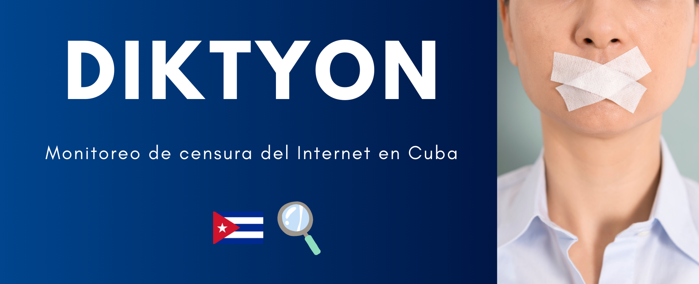

<a href="https://x.com/DiktyonCuba?t=U3DalO5n0K7K2-_Y9naxFA&s=09">
  
<a href="https://www.facebook.com/DiktyonCuba">
  

---

# Tabla de contenidos

- [¿ Quiénes somos ?](#¿quienes-somos?)
- [Informes](#informes)
- [Investigaciones y descubrimientos](#investigaciones-y-descubrimientos)

# ¿ Quiénes somos ?

- [Échale un vistazo a Diktyon (@DiktyonCuba)](https://x.com/DiktyonCuba?t=U3DalO5n0K7K2-_Y9naxFA&s=09)

Somos una fuente independiente de consulta y monitoreo sobre la salud de Internet y censura dentro de Cuba. 

Nos dedicamos a:

- Monitoreo de la censura de Internet en Cuba. 

- Conocer el estado de Internet en Cuba a través de mediciones técnicas. 

- Difundir nuestros hallazgos

# Informes

Nuestro equipo publica trimestralmente un informe sobre el estado de la salud del Internet en la isla, donde expone los métodos y técnicas que se utiliza el gobierno para aplicar censura de Inernet en la isla.

- [Informe #6](https://github.com/diktyoncuba/public/blob/main/Informes/Informe-6_Jul-Sept-2024.pdf)
- [Informe #5](https://github.com/diktyoncuba/public/blob/main/Informes/Informe-5_Abr-Jun-2024.pdf)
- [Informe #4](https://github.com/diktyoncuba/public/blob/main/Informes/Informe-4_Ene-Mar-2024.pdf)
- [Resumen de 2023](https://github.com/diktyoncuba/public/blob/main/Informes/Resumen_2023.pdf)
- [Informe #3](https://github.com/diktyoncuba/public/blob/main/Informes/Informe-3_Sep-Nov-2023.pdf)
- [Informe #2](https://github.com/diktyoncuba/public/blob/main/Informes/Informe-2_Jun-Ago-2023.pdf)
- [Informe #1](https://github.com/diktyoncuba/public/blob/main/Informes/Informe-1_Mar-May-2023.pdf)

# Investigaciones adicionales
Adicionalmente, publicamos las investigaciones adicionales o complementarias a los informes trimestrales.

- [Corte de Internet del 18 de octubre de 2024](https://github.com/diktyoncuba/public/blob/main/Extras/20241018-Corte_Internet_Octubre_2024.pdf)
- [Corte de Internet del 6 de noviembre de 2024](https://github.com/diktyoncuba/public/blob/main/media/DocumentoPorSubir.pdf)
- [Corte de Internet del 4 de diciembre de 2024](https://github.com/diktyoncuba/public/blob/main/media/DocumentoPorSubir.pdf)

# Investigaciones y descubrimientos

En el trabajo investigativo que ha venido haciendo el equipo **Diktyon** sobre el estado y la salud del Internet en Cuba, ha podido identificar los principales tipos de censura que aplica el gobierno en la isla, los cuales afectan el libre acceso a la información por porte de sus habitantes.

**Bloqueo de TCP/IP:**

La censura que afecta al protocolo ***TCP (Transmission Control Protocol)*** es una práctica común en países donde existen restricciones en el acceso a Internet. Esta forma de censura puede ser implementada por los Proveedores de Servicios de Internet (ISP, por sus siglas en inglés).
Esta forma de censura se lleva a cabo mediante la manipulación de los paquetes de datos que se transmiten a través del protocolo de transporte. En la mayoría de los casos, esta manipulación implica el envío de un TCP Reset, que es una señal enviada a través de la red con el propósito de interrumpir una conexión TCP existente. Cuando un paquete TCP Reset es enviado, la conexión se cierra de manera abrupta, lo que resulta en la imposibilidad de acceder al sitio web o servicio deseado.

**Bloqueo por HTTP:**

La censura que afecta este protocolo ***HTTP(Protocolo de transferencia de hipertexto o Hypertext Transfer Protocol)*** se refiere, a la práctica de bloquear el acceso a ciertos sitios web mediante la modificación de su contenido, dado que este no viaja encapsulado en protocolo de seguridad (TLS - Transport Layer Security). Así que nos encontramos
mensajes de error falsos o páginas en blanco.
Esta forma de censura se lleva a cabo manipulando las respuestas HTTP, lo que significa que se alteran los paquetes de datos que viajan entre los usuarios y el servidor web.

**Bloqueo por DNS:**

Las empresas, los gobiernos u otras entidades proveedoras de servicio en Internet pueden gestionar determinadas zonas ***DNS(Domain Name System o Sistema de nombre de dominio)*** y aprovechar para bloquear ciertos sitios web manipulando estas respuestas DNS. Por lo tanto, al intentar acceder a una web bloqueada, la consulta DNS nos responde con una dirección IP diferente, impidiendo así el acceso al contenido deseado.
La censura por DNS es una forma comúnmente utilizada para restringir el acceso a información y controlar la navegación en Internet en la gran mayoría de países.

**Tecnología DPI:**

La tecnología ***DPI (Inspección a fondo de los paquetes)*** es usada en equipos confeccionados por empresas como Huawei, Fortinet, Allot, y vendidos a quienes controlan el acceso a Internet, los ISP, con el objetivo de controlar, inspeccionar y también censurar el acceso libre a la información. Cuando hablamos de censura mediante tecnología DPI nos referimos a la práctica de bloquear ciertos contenidos en Internet mediante la inspección detallada de los paquetes de datos que se envían a través de la red. Esta tecnología es capaz de analizar el contenido de los paquetes de datos y no solamente el encabezado. Incluso manipulando paquetes del
protocolo TLS, por ejemplo falsificando el contenido de una web de HTTPS gracias al envío de certificados de falsas autoridades certificadoras (CA).
Utilizando herramientas de análisis de redes para auditar el tráfico de red en Cuba, se puede observar el identificador **V2R2C00-
IAE/1.0** en muchos de ellos en el header de paquetes HTTP. Este identificante está vinculado a la empresa china Huawei, tal y como se describe y se analiza en investigaciones precedentes:
-  [Informe de OONI Measuring Internet Censorship in Cuba's ParkNets publicado en el 2017](https://ooni.org/post/cuba-internet-censorship-2017/%23deep-packet-inspection-technology) donde describen que al acceder a determinados sitios web
bloqueados en Cuba el encabezado del servidor contenía V2R2C00-IAE/1.0 y lo asociaban a la plataforma de Huawei llamada eSight.
- En un [artículo en NTD - News](https://www.ntd.com/cuba-accused-of-using-chinese-tech-systems-to-block-internet-access-amid-protests_642194.html) se mencionan otros casos de censura similares que también mencionan que ese header está vinculado con un equipo de la marca Huawei conocido como: eSight, esto muestra que se esté usando tecnología DPI para censurar el acceso a internet desde la isla.
- “El encabezado IAE sugiere la presencia de un "Motor de Conciencia Inteligente", que podría referirse a un Huawei NIP6000, un avanzado Sistema de Prevención de Intrusiones de Nueva Generación (NGIPS) que admite las Desconexiones de Sesión”, explica [Qurium en una noticia publicada en el año 2020](https://www.qurium.org/alerts/internet-blocking-in-cuba-silencing-dissent-in-the-name-of-moral-and-good-manners/?tztc=1).
- Mientras que la [investigación de Valentin Weber publicada en un informe de Open Technology Fund en 2020](https://www.opentech.fund/news/studying-information-control-diffusion-an-agenda-for-further-research/) revela que se han podido detectar las cajas intermedias de vigilancia de Huawei con la huella digital V2R2C00-IAE/1.0 en varios países, entre ellos Cuba.

---

> **NOTA:** *Para más información se puede consultar nuestra sección de [informes](https://github.com/diktyoncuba/public/tree/develop/Informes) en donde se profundiza en estos temas y en nuestra secciones de sitios censurados hay un histórico del comportamiento de los [sitios webs](https://github.com/diktyoncuba/public/tree/develop/censored_web_sites) que monitorizamos.*
>
> Gran parte de los sitios webs monitoreados  y su clasificación se basa en [CitizebLab](https://github.com/citizenlab/test-lists/blob/master/lists/cu.csv), otros han sido seleccionados por nuestros colaboradores.
